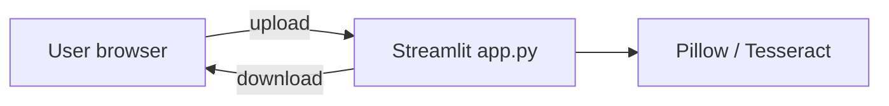
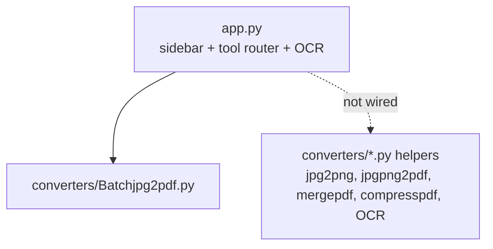

# Architecture Document — Doc Converter (Streamlit)

| Field | Value |
|---|---|
| Document ID | DOCCONV-ARCH |
| Project | Doc Converter (Streamlit) |
| Repository | [`HiravK/doc-converter`](https://github.com/HiravK/doc-converter) |
| Version | 1.0 |
| Status | Approved — living document |
| Owner | Hirav Kadikar |
| Classification | Public |
| Last updated | 2026-09-25 |

> **Purpose:** Explains how the system is built: its parts, how data moves, where it runs, and why it was built this way. Structured on the C4 model and arc42.

## 1. Revision history

| Version | Date | Author | Change |
|---|---|---|---|
| 1.0 | 2026-09-25 | Hirav Kadikar | Full documentation suite generated from a complete review of the repository. |

## 2. Introduction and goals

A single Streamlit script (`app.py`) builds the sidebar and renders the selected tool. Batch JPG→PDF lives in
`converters/Batchjpg2pdf.py`; OCR is defined inline in `app.py`. Uploaded files are read in memory by Streamlit; outputs
are written to the system temp folder and offered through `st.download_button`. There is no database.

### Quality goals (in priority order)

| Priority | Quality attribute | What it means here |
|---|---|---|
| 1 | Simplicity | One Python file to run |
| 2 | Portability | Works locally, in Codespaces and on Streamlit Cloud |

## 3. Constraints

- Word→PDF via docx2pdf needs Microsoft Word (Windows/macOS) — not available on Streamlit Cloud/Linux.

## 4. System context (C4 level 1)

Who and what the system talks to.

| External actor / system | Interaction |
|---|---|
| Streamlit | Web UI |
| Pillow | Image handling |
| pytesseract + Tesseract binary | OCR |
| pdf2docx, docx2pdf, PyPDF2, PyMuPDF | Planned conversions |

## 5. Containers (C4 level 2)

## 6. Components (C4 level 3)

| Component | Location | Responsibility |
|---|---|---|
| App | `app.py` | Page config, sidebar tool picker, OCR tool, routing |
| Batch JPG→PDF | `converters/Batchjpg2pdf.py (duplicate: batch_jpg_to_pdf.py)` | Multi-image PDF creation |
| Helpers | `converters/jpg2png.py, jpgpng2pdf.py, mergepdf.py, compresspdf.py, OCR.py` | Unused conversion functions |
| Empty stubs | `converters/pdf2word.py, word2pdf.py, png2jpg.py, test.py` | Placeholders |
| Dev container | `.devcontainer/devcontainer.json` | Codespaces setup and auto-start |

## 7. Runtime view — key flows

_Single-step flows only; see components._

## 8. Data architecture

No stored data. Batch output is written to `<tmp>/batch_output.pdf` (same name for every user) and removed at process exit.

## 9. Deployment view

Not deployed. Can be deployed on Streamlit Community Cloud (point it at app.py) after fixing requirements.txt; add `packages.txt` with `tesseract-ocr` for OCR.

| Environment | Where | Notes |
|---|---|---|
| Local | http://localhost:8501 | `streamlit run app.py` |
| Codespaces | Forwarded port 8501 | Dev container auto-starts the app |

## 10. Technology stack

| Layer | Technology | Why |
|---|---|---|
| UI | Streamlit | Web interface |
| Images | Pillow | Image conversion |
| OCR | pytesseract + Tesseract | Text extraction |
| Planned | pdf2docx, docx2pdf, PyPDF2, PyMuPDF | Future converters |

## 11. Cross-cutting concepts

## 12. Architecture decisions (ADR log)

### ADR-01: Build the UI with Streamlit

|  |  |
|---|---|
| Status | Accepted |
| Date | 2025-08-04 |
| Context | Wanted a web UI with minimal front-end code. |
| Decision | Use Streamlit widgets (file_uploader, download_button, sidebar). |
| Consequences | Very fast to build; One process shared by all users — temp files must be unique per session |
| Alternatives considered | — |

## 13. Quality scenarios

_None recorded._

## 14. Risks and technical debt

Full register in [PROJECT.md](PROJECT.md#risks-and-technical-debt). Top items:

- **Users try stub tools** — Hide unfinished tools
- **Temp file collision** — Unique temp files

## 15. Glossary

See [PROJECT.md](PROJECT.md#glossary).
