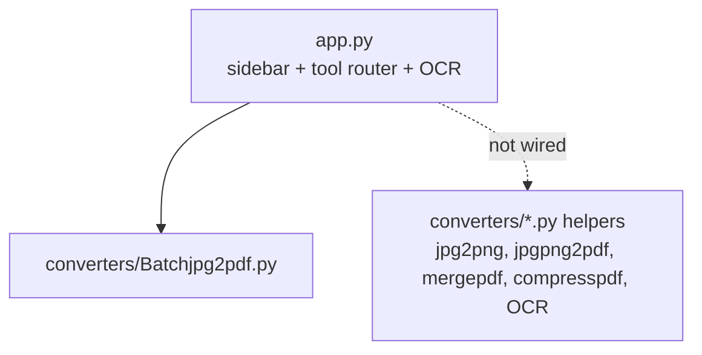

# Doc Converter (Streamlit)

**A Streamlit web app with document tools — batch JPG→PDF and image OCR work today; other converters are stubs.**

     

**doc-converter** is a Python **Streamlit** app (August 2025) that shows a sidebar of nine document tools: PDF→Word,
Word→PDF, JPG→PNG, PNG→JPG, JPG→PDF, Merge PDFs, Compress PDF, Batch JPG→PDF and OCR. In the current code **two tools
work end to end** — *Batch JPG to PDF* (combine many JPGs into one PDF with Pillow) and *OCR* (extract text from an
image with Tesseract). The other seven show "Feature coming soon"; helper modules for image conversion, merge and
compress exist in `converters/` but are not wired into the UI, and some are empty files.

A dev container lets the app start automatically in GitHub Codespaces on port 8501. The project was later superseded by
the browser-only **Local PDF Toolbox** (`open-source-document-converter`, live at convert.hirav.me).

## Table of contents

1. [At a glance](#at-a-glance)
2. [Key features](#key-features)
3. [Tech stack](#tech-stack)
4. [Architecture in one picture](#architecture-in-one-picture)
5. [Repository structure](#repository-structure)
6. [Getting started](#getting-started)
7. [Configuration](#configuration)
8. [Available scripts](#available-scripts)
9. [Testing](#testing)
10. [Deployment](#deployment)
11. [Documentation](#documentation)
12. [Project status](#project-status)
13. [Contributing](#contributing)
14. [Security](#security)
15. [Licence](#licence)
16. [Contacts](#contacts)

## At a glance

|  |  |
|---|---|
| What it is | A small Python web app to convert documents and images, built with Streamlit. |
| Who it is for | Individuals who want simple document conversions; learners exploring Streamlit. |
| Status | Prototype — 2 of 9 tools working |
| Primary language | Python |
| Hosting | Designed for Streamlit Community Cloud / GitHub Codespaces (dev container); not currently linked to a live URL |
| Repository | Public — `HiravK/doc-converter` |
| Default branch | `main` |
| Commits / first / latest | 12 commits · 2025-08-04 → 2025-08-04 |
| Contributors | Hirav Kadikar (12) |
| Upstream | Successor of HiravK/PDFtoWord (Flask, 2024). The browser-only successor with 20 working tools is HiravK/open-source-document-converter (convert.hirav.me). |

## Key features

- **Batch JPG to PDF** — Upload several JPG/JPEG files; they are converted to RGB and saved as one multi-page PDF for download
- **OCR (image)** — Upload JPG/PNG; Tesseract extracts the text into a text box
- **Other tools (stubs)** — PDF→Word, Word→PDF, JPG→PNG, PNG→JPG, JPG→PDF, Merge, Compress show "Feature coming soon" | Not built
- **Codespaces dev container** — Python 3.11 image; installs requirements and starts Streamlit on 8501 automatically

## Tech stack

| Layer | Technology | Why it is used |
|---|---|---|
| UI | Streamlit | Web interface |
| Images | Pillow | Image conversion |
| OCR | pytesseract + Tesseract | Text extraction |
| Planned | pdf2docx, docx2pdf, PyPDF2, PyMuPDF | Future converters |

## Architecture in one picture



Full detail: [docs/ARCHITECTURE.md](docs/ARCHITECTURE.md).

## Repository structure

```text
doc-converter/
├── app.py
├── converters/
│   ├── Batchjpg2pdf.py, batch_jpg_to_pdf.py (duplicate)
│   ├── OCR.py, compresspdf.py, jpg2png.py, jpgpng2pdf.py, mergepdf.py
│   └── pdf2word.py, word2pdf.py, png2jpg.py, test.py (empty)
├── requirements.txt
├── .devcontainer/devcontainer.json
└── readme.md
```

## Getting started

### Prerequisites

- Python 3.9+ (3.11 in the dev container)
- Tesseract OCR installed for the OCR tool (`brew install tesseract` / `apt install tesseract-ocr`)

### Install and run locally

```bash
git clone https://github.com/HiravK/doc-converter.git
cd doc-converter
python -m venv .venv && source .venv/bin/activate
pip install streamlit pillow pytesseract pdf2docx PyPDF2 pymupdf   # requirements.txt has an invalid last line
streamlit run app.py      # http://localhost:8501
```

## Configuration

No environment variables or secrets are required.

## Available scripts

| Command | What it does |
|---|---|
| `streamlit run app.py` | Start the app |

## Testing

No automated tests (`converters/test.py` is empty). See [docs/PROJECT.md](docs/PROJECT.md#quality-and-testing).

## Deployment

Not deployed. Can be deployed on Streamlit Community Cloud (point it at app.py) after fixing requirements.txt; add `packages.txt` with `tesseract-ocr` for OCR. Step-by-step: [docs/RUNBOOK.md](docs/RUNBOOK.md).

## Documentation

Every document below is part of the project's controlled documentation set.

| Document | Audience | What it answers |
|---|---|---|
| [README](README.md) | Everyone | What is it, how do I run it, where is everything? |
| [Project Overview (in depth)](docs/PROJECT.md) | Everyone | Why it exists, every feature explained, timeline, quality, security, risks, glossary |
| [Product Requirements (PRD)](docs/PRD.md) | Product, business, engineering | What problem, for whom, what must it do, how is success measured? |
| [Architecture](docs/ARCHITECTURE.md) | Engineers, architects | How is it built, how does data flow, where does it run, why? |
| [Runbook](docs/RUNBOOK.md) | Engineers, operators | How do I set it up, configure, deploy, roll back and troubleshoot it? |
| [Session Handover](docs/SESSION_HANDOVER.md) | Next owner / next session | Where exactly did work stop and what is next? |

## Project status

Two of nine tools work. The project stopped in August 2025 and was superseded by the browser-only toolbox at
convert.hirav.me. Keep as a learning project or archive.

Latest hand-off notes: [docs/SESSION_HANDOVER.md](docs/SESSION_HANDOVER.md).

## Contributing

Branch from the default branch (`feat/…`, `fix/…`), use Conventional Commit messages, open a pull request, and update the docs in the same PR.

## Security

Please do not open public issues for vulnerabilities; contact the maintainer privately. Security design is covered in [docs/PROJECT.md](docs/PROJECT.md#security-and-privacy).

## Licence

No licence file is present, so all rights are reserved by the owner by default. Add a `LICENSE` file before accepting outside contributions or reuse.

## Contacts

| Role | Name | Contact |
|---|---|---|
| Owner / maintainer | Hirav Kadikar | [@HiravK](https://github.com/HiravK) |
